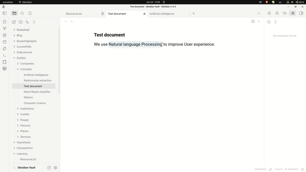

# Entity Linker

Entity linker is an Obsidian plugin links research terms to corresponding standard entities(wikidata, wikipedia,
openalex)

### Usage

This plugin has two commands:

1. `Link selection to entity`, which suggest entities using the selected text as search term.
2. `Link active note to entity`, which suggest entities using the active note's title as search term.

### Demo
#### Entity linking via selection as well as active note

### How it works

Plugins uses [OpenAlex](https://docs.openalex.org/) api to search for terms and create entity note for the same.

### Installation

#### From github

1. Go to the [Releases](https://github.com/Ankush-Chander/obsidian-entity-linker/releases) page.
2. Download the latest obsidian-entity-linker-${version}.zip.
3. Extract its contents.
4. Move the contents into /your-vault/.obsidian/plugins/obsidian-entity-linker/.
5. Enable the plugin in Obsidian:
	- Open Obsidian, go to Settings > Community Plugins.
	- Make sure Restricted mode is off.
	- Search installed plugins for entity-linker.
	- Click Enable.

#### From within Obsidian

You can install this plugin within Obsidian by doing the following:

1. Open Settings > Community plugins.
2. Make sure Restricted mode is off.
3. Click Browse.
4. Search for Entity Linker.
5. Click Install.
6. Once installed, click Enable.

[//]: # (### Changelog)

### For development

#### Compilation

1. Clone this repo inside path/to/your/dev/vault/.obsidian/plugins.
2. npm i or yarn to install dependencies
3. npm run build to compile, or npm run dev to start compilation in watch mode.

### Roadmap

- [x] First release
- [ ] Add fuzzy logic
- [ ] Add direct search

### FAQs

1. **Why is email(optional) asked in settings?**  
   We use OpenAlex API for fetching metadata. Their API is rate limited. If you add your email in the request, your
   requests goes
   into [polite pool](https://docs.openalex.org/how-to-use-the-api/rate-limits-and-authentication#the-polite-pool) which
   has much faster and more consistent response times.

### Recommendations

1. [Obsidian Wikidata Importer](https://github.com/samwho/obsidian-wikidata-importer) pulls data from the Wikidata
   database into your Obsidian notes
2. [Obsidian Wikipedia](https://github.com/jmilldotdev/obsidian-wikipedia) gets the first section of Wikipedia and
   pastes it into your active note.

### Acknowledgement

1. Thanks to [OpenAlex](https://openalex.org/) team for providing free for use API over scholarly works
2. Thanks to [Obsidian](htts://obsidian.md]) team for upholding malleability in the product that allows people to add
   and share new features
   without hassle.
