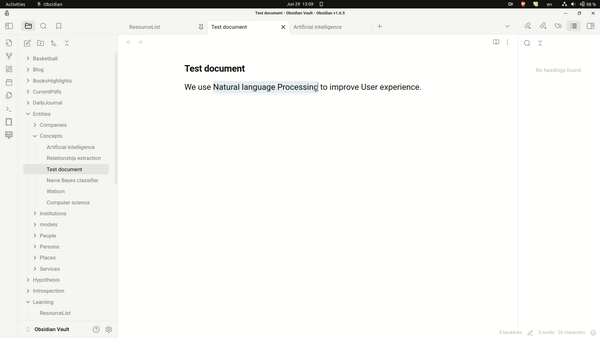

# Entity Linker

Entity linker is an Obsidian plugin links research terms to corresponding standard entities(wikidata, wikipedia,
openalex)

### Usage

This plugin has two commands:

1. `Link selection to entity`, which suggests entities using the selected text as search term. On choosing a
   suggestion it resolves the entity note (creating it if it does not exist yet) and replaces the selection with a
   link to it. If the canonical name differs from the text you selected, the link is aliased
   (`[[Post-training quantization|PTQ]]`) so your prose reads as written.
2. `Link active note to entity`, which suggests entities using the active note's title as search term, and writes the
   resolved properties into the frontmatter of **the note you are in**. It never creates a separate note.

Before creating anything, the plugin looks for an existing note of that name anywhere in the vault, so a note you
already filed by hand is reused rather than duplicated under a different folder or casing.

### Settings

| Setting | Effect |
| --- | --- |
| Polite email | Sent to the OpenAlex API for faster, more consistent responses. |
| Entity folder | Where notes for named entities (the Wikipedia/Wikidata results) are created. |
| Concept folder | Where notes for OpenAlex concept results are created. Leave empty to keep everything in the entity folder. |
| Overwrite existing properties | If checked, existing properties are overwritten instead of preserved. |
| Insert link at selection | Replace the selected text with a link to the note instead of opening it in a new tab. |
| Record aliases | Add the searched term and canonical name to the note's `aliases` so both resolve to it. |

Properties that resolve to nothing are skipped rather than written as blanks, so a note never accumulates empty
`wikidata:` / `mag:` / `umls_cui:` keys.

### Demo
#### Entity linking via selection as well as active note

### How it works

The plugin queries the [OpenAlex](https://docs.openalex.org/) concepts API for the search term. OpenAlex concepts are
scholarly topics, so those hits are filed to the **concept folder**. When OpenAlex returns nothing, the plugin falls
back to resolving the term against Wikipedia/Wikidata, and those hits — typically people, organisations and other
named things — are filed to the **entity folder**.

### Installation

#### From github

1. Go to the [Releases](https://github.com/Ankush-Chander/obsidian-entity-linker/releases) page.
2. From the latest release, download `main.js`, `manifest.json` and `styles.css` from the **Assets** section.
   The auto-generated "Source code" archives will not work: `main.js` is a build artifact and is not committed.
3. Create the folder `/your-vault/.obsidian/plugins/entity-linker/` if it does not already exist.
4. Move the three downloaded files into that folder.
5. Enable the plugin in Obsidian:
	- Open Obsidian, go to Settings > Community Plugins.
	- Make sure Restricted mode is off.
	- Search installed plugins for entity-linker.
	- Click Enable.

#### From within Obsidian

You can install this plugin within Obsidian by doing the following:

1. Open Settings > Community plugins.
2. Make sure Restricted mode is off.
3. Click Browse.
4. Search for Entity Linker.
5. Click Install.
6. Once installed, click Enable.

[//]: # (### Changelog)

### For development

#### Compilation

1. Clone this repo inside path/to/your/dev/vault/.obsidian/plugins.
2. npm i or yarn to install dependencies
3. npm run build to compile, or npm run dev to start compilation in watch mode.

### Roadmap

- [x] First release
- [ ] Add fuzzy logic
- [x] Add direct search

### FAQs

1. **Why is email(optional) asked in settings?**  
   We use OpenAlex API for fetching metadata. Their API is rate limited. If you add your email in the request, your
   requests goes
   into [polite pool](https://docs.openalex.org/how-to-use-the-api/rate-limits-and-authentication#the-polite-pool) which
   has much faster and more consistent response times.

### Recommendations

1. [Obsidian Wikidata Importer](https://github.com/samwho/obsidian-wikidata-importer) pulls data from the Wikidata
   database into your Obsidian notes
2. [Obsidian Wikipedia](https://github.com/jmilldotdev/obsidian-wikipedia) gets the first section of Wikipedia and
   pastes it into your active note.

### Acknowledgement

1. Many thanks to [
Shaun Martin](https://github.com/inhumantsar) for [File Suggestion Component](https://github.com/inhumantsar/obsidian-file-suggestion-component) which this plugin relies on.
2. Thanks to [OpenAlex](https://openalex.org/) team for providing free for use API over scholarly works.
3. Thanks to [Obsidian](htts://obsidian.md]) team for upholding malleability in the product that allows people to add
   and share new features.
   without hassle.
